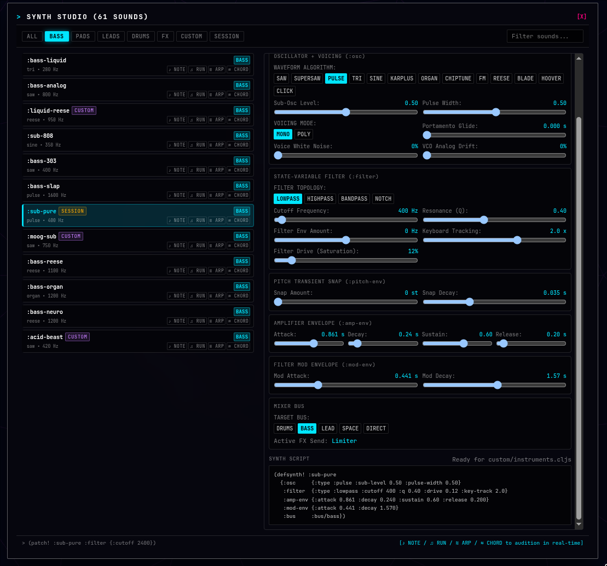
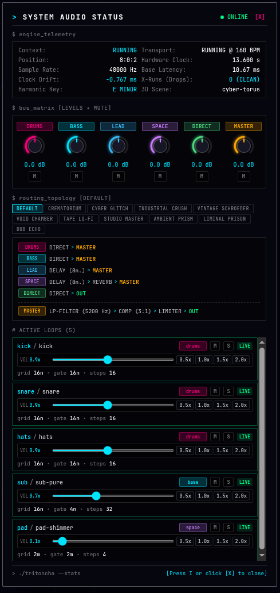
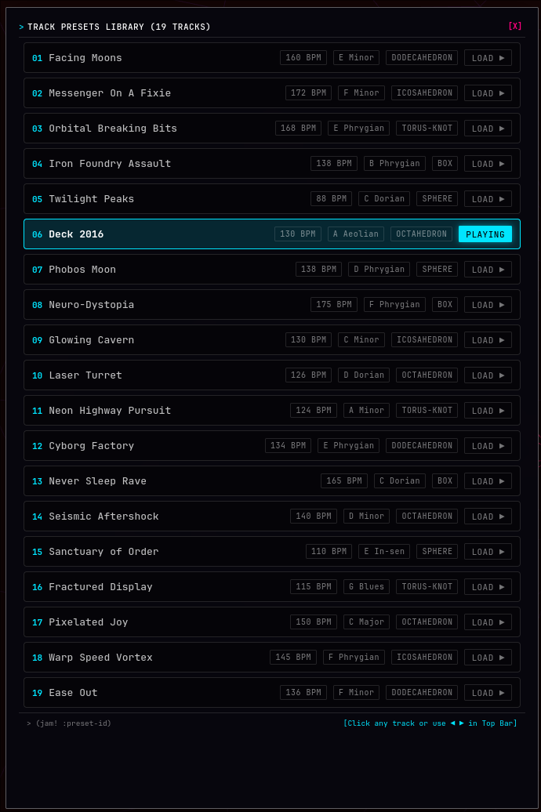

# Tritoncha


**Live-coding WebDAW + audio-reactive 3D visuals in your browser.**
Shape algorithmic music with ClojureScript, driven by a real-time Rust WebAssembly audio engine and Three.js.

[](https://github.com/tmythicator/tritoncha/actions/workflows/ci.yml)
[](LICENSE)

**Live Studio:** [https://tmythicator.github.io/tritoncha/](https://tmythicator.github.io/tritoncha/)

---

## WebDAW Features

|                                                                    Synth Studio                                                                     |
| :-------------------------------------------------------------------------------------------------------------------------------------------------: |
|                                                                                                      |
| Tweak oscillators, filters, and envelopes with live sliders. Audition sounds in real time and export ClojureScript code straight into your session. |

|       System Audio Status + Mixer Matrix        |               Track Presets Library                |
| :---------------------------------------------: | :------------------------------------------------: |
|  |  |

---

## How It Works

Tritoncha combines ClojureScript for interactive live-coding with Rust compiled to WebAssembly for real-time audio:

- **ClojureScript (Live Coding):** Define synths, arrange patterns, and modulate scales on the fly using Clojure maps. Hot-reloads instantly without stopping playback.
- **Rust WASM (Audio Engine):** Runs in a dedicated WebAudio worklet thread. Handles polyphonic synthesis, drum modeling, sequencing, and stereo effects with low latency and zero garbage collection pauses.
- **Three.js (3D Visuals):** Audio triggers and pitch pulses stream directly into WebGL shaders, pulsing geometry and colors to the beat.
- **Visual GUI Tools:** A built-in synth editor, mixer matrix, and preset browser make it easy to explore sounds without typing code from scratch.

---

## Features

- **Algorithmic Composition:** Musical scales and modes, scale degrees (`deg`, `d`), chords, Euclidean rhythms (`euclid`, `euc`), and Tidal-style mini-notation (`pattern`, `pat`).
- **Synthesis:** 32 polyphonic voices, Moog 4-pole ladder and state-variable filters, supersaw, Karplus-Strong string modeling, and physical/analog drum synthesis.
- **Mixer + Effects:** 5 stereo busses (`:drums`, `:bass`, `:lead`, `:space`, `:direct`) with stereo delay, FDN reverb, stereo bus compressor.
- **Zero Setup:** Runs entirely in modern browsers. No DAWs, background daemons, or native plugins required.
- **Emacs + CIDER:** First-class nREPL support for live performance.

---

## Quick Start

```bash
# 1. Enter the dev environment
nix develop
# (or simply `direnv allow` if you use direnv)

# 2. Start the dev server
pnpm run dev
```

Open [http://localhost:3000](http://localhost:3000) and click anywhere on the page to unlock WebAudio.

---

## Emacs + CIDER Setup

Tritoncha is built for an interactive Emacs live-coding workflow:

1. **Start the watch server:** Run `pnpm run dev` in your shell.
2. **Connect from Emacs:** In Emacs, run:
   ```
   M-x cider-connect-cljs
   ```
   When prompted, select `shadow` -> `:app`.
3. **Switch to REPL / Scratchpad:** Open `src/app/live/jam.cljs` or `src/app/demo/tutorial.cljs` and evaluate forms with `C-c C-e` (eval form) or `C-c C-k` (eval buffer).

---

## Cheatsheet

> [!TIP]
> For the interactive masterclass covering breakbeat grooves, ghost notes, probabilistic mutations (`sometimes`, `every-n`), and procedural 3D scenes, see [src/app/demo/tutorial.cljs](src/app/demo/tutorial.cljs).

### 1. Playback and Preset Jams

```clojure
(jam! :acid-roller)
(b! 174)
(stop!)
```

### 2. Live Drum Loops

```clojure
;; Mini-notation with accents (!) and ghost notes (_)
(l! :drums {:inst :drums :notes (pat "k! . s_ .  s_ k_ s! s_  . s_ k! .  s! s_ s_ s!") :step "16n"})

;; Euclidean hi-hat groove with dynamic velocity vector
(l! :hat   {:inst :hh-c :mask (euc 11 16) :step "16n" :dur "32n" :vel [0.3 0.7 0.4 0.9]})

;; Multi-hit drum step layering
(l! :drums {:hits [[:kick 1.0 "D1"] [:hh-c 0.4] [[:snare 1.0 "G3"] [:hh-c 0.45]] [:hh-c 0.4]]})

;; Polyrhythmic ride bells, splashes and china hits
(l! :cymb  {:inst :drums :notes (pat "rb! . rb_ .  rb! . sp! .  rb_ rb! . rb_  cr16! . ch! .")})
```

### 3. Melodic Synths, Basslines and Chords

```clojure
;; Scale degree bassline in active key (1-based, rests _ or nil)
(l! :bass  {:inst :bass :notes (d [1 _ 1 2 _ 1 4 3  1 _ 5 4 _ 2 1 _]) :step "16n" :dur "16n" :vel 0.95})

;; Euclidean arpeggiator over a 9th chord
(l! :arp   {:inst :pad :notes (arp (chord :e :min9 3) :up-down) :mask (euc 7 16) :step "16n" :vel 0.22})

;; Time transformation (fast, rev)
(l! :bass  {:notes (fast 2 (d [1 _ 1 2 _ 1 4 3])) :step "16n"})
(l! :bass  {:notes (rev (d [1 _ 1 2 _ 1 4 3])) :step "16n"})

;; Generative pipeline with Clojure threading (->>)
(l! :lead  {:inst :pad
            :notes (->> (chord :e :min9 3) (arp :up-down) (fast 2) (shift 1))
            :step "16n" :vel 0.5})

;; Multi-track stack launcher (hot-swap everything in one form)
(stack!
 [:kick  (pat "k! . . k_  . k_ k! .  k! . . k_  . k! . .")]
 [:snare (pat ". . s_ .  s! s_ . s_  . s_ s_ s!  s_ . s! s_")]
 [:bass  {:notes (d [1 _ 1 2 _ 1 4 3  1 _ 5 4 _ 2 1 _] 1) :step "16n" :dur "16n"}]
 [:pad   {:notes (arp (chord :e :min9 3) :up-down) :mask (euc 7 16) :step "16n"}])
```

### 4. Live Harmonic Modulation and Transposition

```clojure
;; Modulate all running loops into a new key or mode on the fly
(mod-all! :d :dorian)
(mod-all! :f# :hirajoshi)
(mod-all! :a :hungarian-minor)
(mod-all! :e :blues)
(mod-all! :e :phrygian)

;; Transpose all active loops live (semitones)
(tr-all! 2)
(tr-all! -2)
```

### 5. Live Sound Design and Custom Tracks

```clojure
;; Define a custom synthesizer patch live in the REPL
(defsynth! :supersaw-lead-custom
  {:category :leads :type :mono :bus :bus/space
   :osc      {:type :supersaw :sub-level 0.4 :drift 0.2}
   :filter   {:type :lowpass :cutoff 1400 :q 0.5 :drive 0.25 :env-amount 3000}
   :amp-env  {:attack 0.01 :decay 0.2 :sustain 0.7 :release 0.25}
   :glide    0.03})

(demo! :supersaw-lead-custom)
(demo-stop!)

;; Define a complete custom track arrangement
(deftrack! :cyber-roller-custom
  {:name   "Cyber Roller In D Dorian"
   :bpm    174
   :scale  [:d :dorian 1]
   :cutoff 3800
   :tracks
   {:drums {:notes (pat "k! . . .  s! . . .  . . k_ .  s! . . .") :step "16n"}
    :hat   {:inst :hh-c :mask (euc 11 16) :step "16n" :dur "32n"}
    :bass  {:inst :bass :notes (d [1 _ 1 2 _ 1 4 3]) :step "16n"}
    :pad   {:inst :pad  :notes (arp (chord :d :min9 3) :up-down)}}})

(jam! :cyber-roller-custom)
```

### 6. Mixer, Performance Transitions and Dub FX

```clojure
;; Track mutes, solo and drummer tools
(m! :kick :snare)
(u! :kick :snare)
(undrum!)
(redrum!)
(click!)

;; Filters, delay, reverb and dub triggers
(f! 450)
(sw! 400 5500 4)
(fb! 0.6)
(wet! 0.45)
(s!)
(drop!)
```

### 7. Audio-Reactive 3D Visuals

```clojure
;; Morph geometry: :torus-knot, :icosahedron, :octahedron, :sphere, :box, :dodecahedron
(g! :torus-knot)

;; Switch 3D scene: :cyber-torus, :quantum-polyhedron, :monolith-core, :crystal-octahedron, :acid-sphere
(scene! :quantum-polyhedron)

;; Toggle wireframe mode
(w!)

;; Background and mesh shader colors
(c! "#080412" "#00ffaa")
```

---

## Project Layout

- `src/app/demo/tutorial.cljs` Interactive masterclass tutorial
- `src/app/live/` Live performance scratchpads (`jam.cljs`, `jam_1.cljs` .. `jam_4.cljs`)
- `src/app/ui/instrument_browser/` Visual Instrument Studio and Audition Lab GUI
- `src/app/custom/` User sandbox for custom synths, tracks, and audio routings
- `src/app/lib/` Built-in synths, drum voices, track catalog, and default bus routing
- `crates/tritoncha-dsp/` Dedicated Rust WebAssembly real-time DSP audio engine
- `src/app/audio/` WebAudio AudioWorklet bridge, looper, and mixer
- `src/app/visuals/` Three.js WebGL reactive visuals engine

---

## License

Copyright © 2026 Alexandr Timchenko.
Licensed under the [GNU Affero General Public License v3.0 (AGPL-3.0)](LICENSE).
