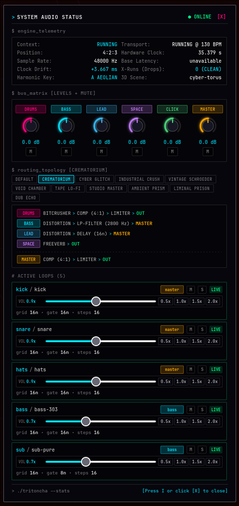

# Tritoncha


**Live-coding WebDAW + audio-reactive 3D visuals in your browser.**
Shape algorithmic music with ClojureScript, driven by a real-time Rust WebAssembly audio engine and Three.js.

[](https://github.com/tmythicator/tritoncha/actions/workflows/ci.yml)
[](LICENSE)

**Live Studio:** [https://tmythicator.github.io/tritoncha/](https://tmythicator.github.io/tritoncha/)

---

## WebDAW Features

|                                                                    Synth Studio                                                                     |
| :-------------------------------------------------------------------------------------------------------------------------------------------------: |
|                                                                                                      |
| Tweak oscillators, filters, and envelopes with live sliders. Audition sounds in real time and export ClojureScript code straight into your session. |

|       System Audio Status + Mixer Matrix        |               Track Presets Library                |
| :---------------------------------------------: | :------------------------------------------------: |
|  |  |

---

## How It Works

Tritoncha combines ClojureScript for interactive live-coding with Rust compiled to WebAssembly for real-time audio:

- **ClojureScript (Live Coding):** Define synths, arrange patterns, and modulate scales on the fly using Clojure maps. Hot-reloads instantly without stopping playback.
- **Rust WASM (Audio Engine):** Runs in a dedicated WebAudio worklet thread. Handles polyphonic synthesis, drum modeling, sequencing, and stereo effects with low latency and zero garbage collection pauses.
- **Three.js (3D Visuals):** Audio triggers and pitch pulses stream directly into WebGL shaders, pulsing geometry and colors to the beat.
- **Visual GUI Tools:** A built-in synth editor, mixer matrix, and preset browser make it easy to explore sounds without typing code from scratch.

---

## Features

- **Algorithmic Composition:** Musical scales and modes, scale degrees (`deg`, `d`), chords, Euclidean rhythms (`euclid`, `euc`), and Tidal-style mini-notation (`pattern`, `pat`).
- **Synthesis:** 32 polyphonic voices, Moog 4-pole ladder and state-variable filters, supersaw, Karplus-Strong string modeling, and physical/analog drum synthesis.
- **Mixer + Effects:** 5 stereo busses (`:drums`, `:bass`, `:lead`, `:space`, `:direct`) with stereo delay, FDN reverb, stereo bus compressor.
- **Zero Setup:** Runs entirely in modern browsers. No DAWs, background daemons, or native plugins required.
- **Emacs + CIDER:** First-class nREPL support for live performance.

---

## Quick Start

```bash
# 1. Enter the dev environment
nix develop
# (or simply `direnv allow` if you use direnv)

# 2. Start the dev server
pnpm run dev
```

Open [http://localhost:3000](http://localhost:3000) and click anywhere on the page to unlock WebAudio.

---

## Emacs + CIDER Setup

Tritoncha is built for an interactive Emacs live-coding workflow:

1. **Start the watch server:** Run `pnpm run dev` in your shell.
2. **Connect from Emacs:** In Emacs, run:
   ```
   M-x cider-connect-cljs
   ```
   When prompted, select `shadow` -> `:app`.
3. **Switch to REPL / Scratchpad:** Open `src/app/live/jam.cljs` or `src/app/demo/tutorial.cljs` and evaluate forms with `C-c C-e` (eval form) or `C-c C-k` (eval buffer).

---

## Cheatsheet

> [!TIP]
> For the interactive masterclass covering breakbeat grooves, ghost notes, probabilistic mutations (`sometimes`, `every-n`), and procedural 3D scenes, see [src/app/demo/tutorial.cljs](src/app/demo/tutorial.cljs).

### 1. Preset Jams

Launch preset tracks, cycle through the library, tweak tempo, or toggle the metronome:

```clojure
;; Launch built-in jams
(jam! :acid-roller)
(jam! :orbital-matrix)

;; Cycle through the track catalog
(next-jam!)
(prev-jam!)

;; Live tempo and metronome click
(b! 174)
(toggle-click!)

;; Full stop
(stop!)
```

### 2. Live Loops (`l!` / `loop!`)

Hot-swap individual tracks on the fly. Loops align to the global quantization clock:

```clojure
;; Mini-notation drum beat (! accent, _ ghost note, . rest)
(l! :drums {:inst :drums :notes (pat "k! . s_ .  s_ k_ s! s_  . s_ k! .  s! s_ s_ s!") :step "16n"})

;; Euclidean hi-hat rhythm (11 hits over 16 steps)
(l! :hat   {:inst :hat-closed :mask (euc 11 16) :step "16n" :dur "32n" :vel [0.3 0.7 0.4 0.9]})

;; Scale degree bassline in active key (1-based, rests _ or nil)
(l! :bass  {:inst :liquid-reese :notes (d [1 _ 1 2 _ 1 4 3  1 _ 5 4 _ 2 1 _] 1) :step "16n" :dur "16n" :vel 0.95})

;; Euclidean arpeggiator over a minor 9th chord
(l! :arp   {:inst :glass-mallet :notes (arp (chord :e :min9 3) :up-down) :mask (euc 7 16) :step "16n" :vel 0.35})

;; Time transformations (fast, slow, rev, shift)
(l! :bass  {:notes (fast 2 (d [1 _ 1 2 _ 1 4 3])) :step "16n"})
(l! :bass  {:notes (rev (d [1 _ 1 2 _ 1 4 3])) :step "16n"})
```

### 3. Multi-Track Stacking (`stack!`)

Launch or hot-swap an entire groove matrix atomically in a single expression:

```clojure
(stack!
 [:kick  (pat "k! . . k_  . k_ k! .  k! . . k_  . k! . .")]
 [:snare (pat ". . s_ .  s! s_ . s_  . s_ s_ s!  s_ . s! s_")]
 [:cymb  (pat "rb! . rb_ .  rb! . rb_ rb_  rb! . sp! .  rb_ rb! ch! .")]
 [:bass  {:inst :liquid-reese :notes (d [1 _ 1 2 _ 1 4 3  1 _ 5 4 _ 2 1 _] 1) :step "16n" :dur "16n" :vel 0.95}]
 [:sub   {:inst :sub-moog     :notes (d [1 _ _ _ 1 _ _ _  4 _ _ _ 3 _ _ _] 1) :step "16n" :dur "8n"  :vel 1.0}]
 [:pad   {:inst :pad-glass    :notes (arp (chord :e :min9 3) :up-down) :mask (euc 7 16) :step "16n" :vel 0.30}])
```

### 4. Custom Synths and Live Patching (`definst!`, `patch!`)

Define custom DSP instruments or tweak existing voices live without reloading:

```clojure
;; Define a custom synthesizer patch live in the REPL
(definst! :my-supersaw-lead
  {:category :leads :type :poly :bus :bus/lead
   :osc      {:type :supersaw :sub-level 0.4 :drift 0.25}
   :filter   {:type :lowpass :cutoff 1800 :q 0.5 :drive 0.30}
   :amp-env  {:attack 0.01 :decay 0.2 :sustain 0.7 :release 0.25}
   :glide    0.03})

;; Audition the patch
(demo! :my-supersaw-lead)
(demo-stop!)

;; Hot-patch running voices on the fly without redefining
(patch! :my-supersaw-lead :filter {:cutoff 3200 :drive 0.6})
(patch! :my-supersaw-lead :osc    {:drift 0.45})
```

### 5. Full Track Arrangements (`deftrack!`)

Package complete tracks with BPM, musical key, 3D visual scene, routing graph, and track loops into the library:

```clojure
(deftrack! :cyber-roller-custom
  {:name    "Custom Cyber Roller"
   :bpm     174
   :scale   [:d :dorian 1]
   :geom    :torus-knot
   :colors  ["#080412" "#00ffaa"]
   :routing :ambient-prism
   :tracks
   {:drums {:pattern (pat "k . g g  rs! . . .  . . k .  s . . g") :step "16n"}
    :cymb  {:pattern (pat "rd . . .  rb . . .  . . sp .  ch . . .") :step "16n"}
    :hat   {:inst :hat-closed :mask (euc 11 16) :step "16n" :dur "32n" :vel [0.3 0.7 0.4 0.9]}
    :bass  {:inst :bass-liquid :notes (d [1 _ 1 2 _ 1 4 3  1 _ 5 4 _ 2 1 _]) :step "16n" :dur "16n" :vel 0.95}
    :sub   {:inst :sub-808     :notes (d [1 _ _ _ 1 _ _ _  4 _ _ _ 3 _ _ _]) :step "16n" :dur "8n"  :vel 1.0}
    :pad   {:inst :blade-runner :notes (prog [[1 :min9] [6 :maj9] [4 :min7] [7 :dom7]] 3) :step "1m" :dur "1m" :vel 0.40}
    :lead  {:inst :glass-mallet :notes (d [1 3 5 7  8 7 5 3]) :step "16n" :dur "16n" :vel 0.50}}})

;; Play the custom track
(jam! :cyber-roller-custom)
```

### 6. Modular FX Routing Graph (`defroute!`, `route!`)

Define custom audio processor chains per stereo bus (`:drums`, `:bass`, `:lead`, `:space`, `:master`):

```clojure
;; Switch built-in routing graphs
(route! :ambient-prism)
(route! :crematorium)
(route! :default)

;; Define a custom routing topology live from REPL (alias: defroute! or defrouting!)
;; :out bypasses master bus processing straight to DAC
(defroute! :space-dub-custom
  {:graph {:drums  [:crusher :compressor :out]
           :bass   [:distort :filter]
           :lead   [:delay :reverb]
           :space  [:reverb :out]
           :master [:compressor :limiter]}
   :processors {:filter     [2800 0.85]
                :crusher    {:bits 8.0 :sample-hold 1.4 :drive 0.25}
                :distort    {:drive 0.55 :algo :adaa :wet 0.85}
                :delay      ["8n." 0.45 0.35]
                :reverb     {:algo :fdn :size 0.92 :wet 0.48}
                :compressor {:threshold -14.0 :ratio 3.5 :attack 0.010 :release 0.090 :makeup 2.0 :mix 1.0}}})

(route! :space-dub-custom)
(rfx!) ;; Reset processor states and clear reverb/delay tails
```

### 7. Mixer, Performance Mutes and Transitions

Drop drums, cut bass, solo elements, and trigger dub sirens live:

```clojure
;; Track and bus muting
(m! :kick :snare)
(u! :kick :snare)
(undrum!)     ;; Mute drums, keep bass, leads, and pads intact
(redrum!)     ;; Restore drum bus for the drop
(unlead!)     ;; Cut leads and arps
(relead!)     ;; Bring leads back
(unbass!)     ;; Cut bass and sub
(rebass!)     ;; Bass drop
(so! :bass)   ;; Solo bass
(unso!)       ;; Full mix

;; Master filter sweeps and dub triggers
(f! 450)
(sw! 400 5500 4)
(fb! 0.6)
(wet! 0.45)
(s!)          ;; Dub siren
(drop!)       ;; Seismic sub-bass drop
```

### 8. Harmonic Modulation and Scales

```clojure
;; Modulate all running loops into a new scale or mode on the fly
(mod-all! :d :dorian)
(mod-all! :f# :hirajoshi)
(mod-all! :a :hungarian-minor)
(mod-all! :e :phrygian)

;; Live semitone transposition
(tr-all! 2)
(tr-all! -2)
```

### 9. Audio-Reactive 3D Visuals

```clojure
;; Morph geometry: :torus-knot, :icosahedron, :octahedron, :sphere, :box, :dodecahedron
(g! :torus-knot)

;; Switch 3D scene presets
(scene! :synthwave-grid)
(scene! :quantum-polyhedron)

;; Toggle wireframe and change shader colors
(w!)
(c! "#080412" "#00ffaa")
```

---

## Project Layout

- `src/app/demo/tutorial.cljs` Interactive masterclass tutorial
- `src/app/live/` Live performance scratchpads (`jam.cljs`, `jam_1.cljs` .. `jam_4.cljs`)
- `src/app/ui/instrument_browser/` Visual Instrument Studio and Audition Lab GUI
- `src/app/custom/` User sandbox for custom synths, tracks, and audio routings
- `src/app/lib/` Built-in synths, drum voices, track catalog, and default bus routing
- `crates/tritoncha-dsp/` Dedicated Rust WebAssembly real-time DSP audio engine
- `src/app/audio/` WebAudio AudioWorklet bridge, looper, and mixer
- `src/app/visuals/` Three.js WebGL reactive visuals engine

---

## License

Copyright © 2026 Alexandr Timchenko.
Licensed under the [GNU Affero General Public License v3.0 (AGPL-3.0)](LICENSE).
