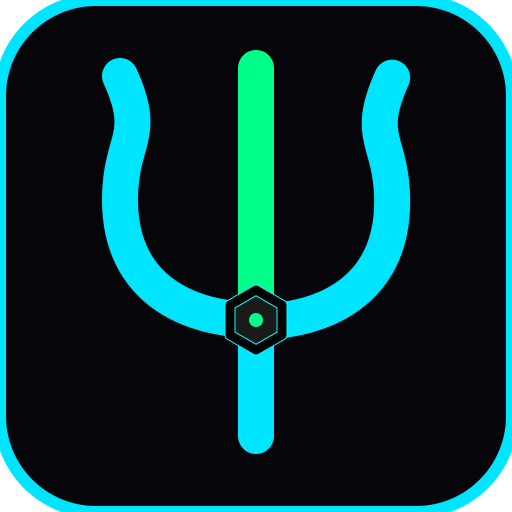

# Tritoncha



Live-coding electronic music and audio-reactive 3D visuals in ClojureScript.

[](https://github.com/tmythicator/tritoncha/actions/workflows/ci.yml)
[](LICENSE)

---

Live Studio: **[https://tmythicator.github.io/tritoncha/](https://tmythicator.github.io/tritoncha/)**

---

## What is Tritoncha?

Tritoncha is an in-browser live-coding studio for electronic music and 3D WebGL visuals. It connects real-time sound synthesis (Tone.js) and procedural 3D graphics (Three.js), controlled live from your editor via a ClojureScript nREPL connection (e.g. Emacs + CIDER) or the in-browser scratchpad.

### Q and A

- **Is it like TidalCycles, Sonic Pi or Overtone?**
  Similar in spirit, but runs entirely in the browser without installing SuperCollider (`scsynth`), audio daemons or any other toolchains.

- **Is it a WebDAW?**
  It has synthesizers, effects, and mixing buses, but you control them through code instead of timeline clicking. You sequence scale degrees (`d`), chords, drum patterns (`pat`) and Euclidean rhythms (`euc`) live in the REPL.

- **How do the 3D visuals react to audio?**
  Direct state sharing. Every beat trigger, sub hit and synth note modulates 3D geometry scales, wireframes, and vertex shaders on every animation frame.

- **Does it work offline?**
  Yes. The entire build compiles into static JavaScript and runs locally without network access.

---

## Quick Start

```bash
# 1. Enter the dev environment
nix develop
# (or simply `direnv allow` if you use direnv)

# 2. Start the dev server
pnpm run dev
```

Open [http://localhost:3000](http://localhost:3000) and click anywhere on the page to unlock the browser's WebAudio context.

---

## REPL Workflow

The fastest way to learn Tritoncha is through the interactive tutorial in `src/app/demo/tutorial.cljs`.

### Emacs + CIDER Setup

1. In Emacs: `M-x cider-connect-cljs`
2. Select `shadow` -> `:app`
3. Switch to `src/app/live/jam.cljs` or `src/app/demo/tutorial.cljs` and evaluate forms with `C-c C-e` or `C-c C-c`.

---

## Cheatsheet

```clojure
;; Start and Stop playback
(play!)                   ;; Start default Phrygian Roller
(jam! :acid-roller)       ;; Launch track preset (:roller, :sub-roller, :acid-roller, :ambient-drift)
(stop!)                   ;; Full audio stop

;; Live Looper and Drum Patterns
(l! :bass  {:inst :bass  :notes (d [1 _ 1 2 _ 1 4 3]) :step "16n"})
(l! :kick  {:inst :kick  :pattern (pat "k . . .  k . . .") :step "16n"})
(l! :hat   {:inst :hh-c  :mask (euc 11 16) :step "16n" :dur "32n"})
(l! :drums {:hits [[:kick 1.0 "D1"] [:hh-c 0.4] [[:snare 1.0 "G3"] [:hh-c 0.45]] [:hh-c 0.4]]})

;; Harmonic Modulation and Transposition
(mod-all! :f :phrygian 1) ;; Modulate all active loops to F Phrygian live
(tr-all! 2)               ;; Transpose all active loops +2 semitones

;; Sound Design and Previews
(demo! :saw-bass)         ;; Audition instrument in active key
(demo-stop!)              ;; Stop auditioning
(refresh!)                ;; Hot-reload updated synth parameters and track definitions

;; Mixer and Transitions
(m! :kick :snare)         ;; Mute drums
(u! :kick :snare)         ;; Unmute drums
(f! 450)                  ;; Set lowpass filter cutoff
(sw! 400 5500 4)          ;; 4-second opening filter sweep into the drop
(s!)                      ;; Dub laser siren
(drop!)                   ;; Seismic sub-bass drop

;; Live Drummer Controls
(undrum!)                 ;; Mute drum loops, keep bass, chords and click
(click!)                  ;; Metronome click in headphones
(redrum!)                 ;; Unmute electronic drums

;; 3D WebGL Visuals
(g! :torus-knot)          ;; Morph 3D geometry (:icosahedron, :torus-knot, :octahedron, :sphere)
(w!)                      ;; Toggle wireframe mode
(c! "#080412" "#ff007f")  ;; Background and mesh shader colors
```

---

## Project Layout

- `src/app/demo/tutorial.cljs` Interactive masterclass tutorial
- `src/app/live/jam.cljs` Live performance scratchpad for fast jams
- `src/app/custom/` Your sandbox for custom synths, tracks and audio routings
- `src/app/lib/` Built-in synths, tracks catalog and default bus routing
- `src/app/audio/` + `visuals/` WebAudio synthesis engine and Three.js WebGL visual engine

---

## License

Copyright © 2026 Alexandr Timchenko.
Licensed under the [GNU General Public License v3.0 (GPL-3.0)](LICENSE).
